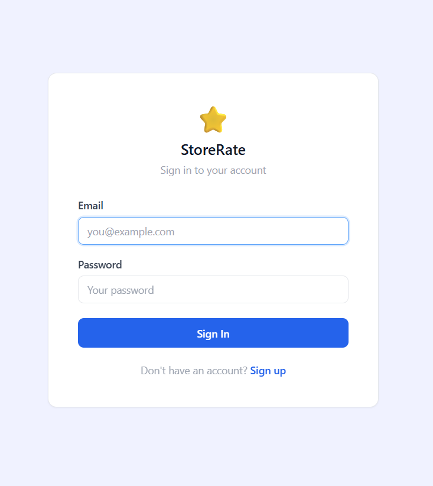
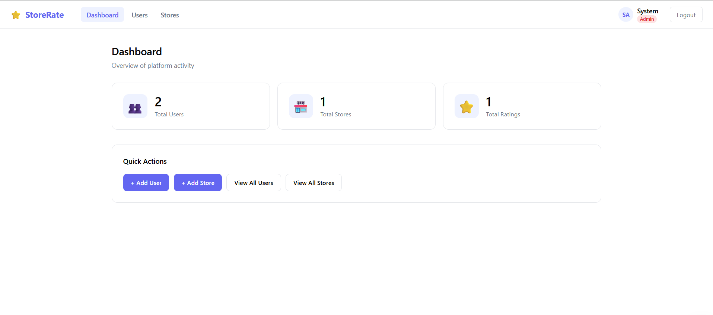
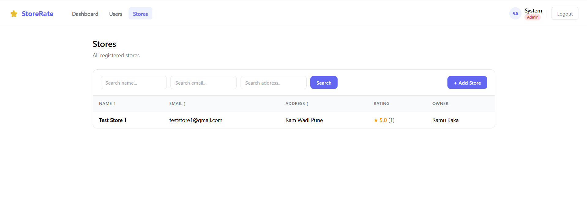
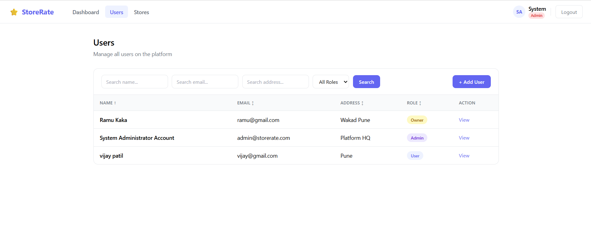

<div align="center">

# ⭐ StoreRate Frontend

### React frontend for the StoreRate store rating platform


🎨 [Live Demo](https://store-rating-frontend-chi.vercel.app) &nbsp;|&nbsp; ⚙️ [Backend Repo](https://github.com/vijaypatil2003/-store-rating-backend)

</div>

---

## 📸 Screenshots

### Login


### Admin Dashboard


### User Stores


### Store Owner


---

## ⚙️ Setup

```bash
git clone https://github.com/vijaypatil2003/store-rating-frontend.git
cd store-rating-frontend
npm install
npm start
```

Runs on: `http://localhost:3000`

---

## 👨‍💻 Author

**Vijay Satish Patil**
- 📧 [vijayptl0106@gmail.com](mailto:vijayptl0106@gmail.com)
- 🐙 [github.com/vijaypatil2003](https://github.com/vijaypatil2003)
- 💼 [linkedin.com/in/vijay-patil-518872254](https://www.linkedin.com/in/vijay-patil-518872254)

---

<div align="center">
⭐ If you found this project useful, consider giving it a star.
</div>
